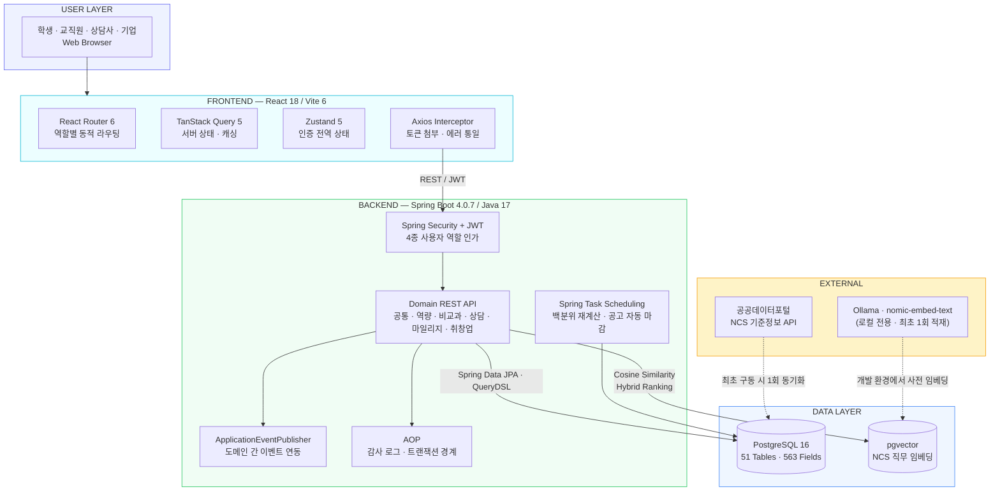
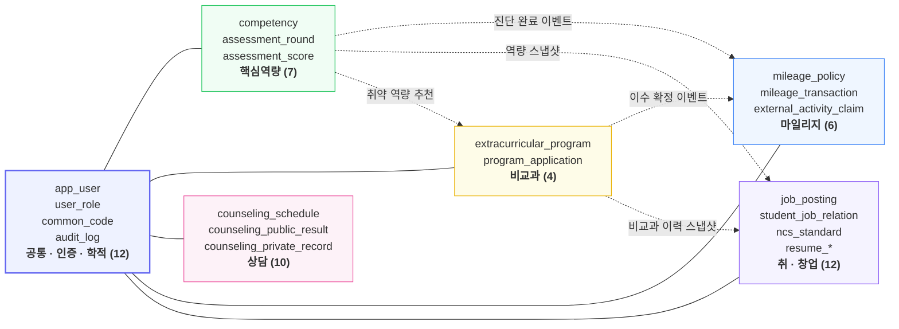

<div align="center">

# 🌟 폴라리스 (POLARIS)

### 대학생 역량 성장 사이클 통합 관리 플랫폼

**진단 → 활동 → 보상 → 진로.** 부서별로 흩어져 있던 학생 성장 데이터를 하나의 흐름으로 연결합니다.

<br>


<br>

**[🔗 서비스 바로가기](https://TODO-배포주소)** · **[📘 API 문서 (Swagger)](https://TODO-배포주소/swagger-ui.html)** · **[⚙️ Backend](https://github.com/Wiza-Project/scms-be)** · **[🎨 Frontend](https://github.com/Wiza-Project/scms-fe)**

</div>

<br>

## 📌 프로젝트 개요

| 항목 | 내용 |
| :--- | :--- |
| **프로젝트명** | 폴라리스 (Student Competency Management System) |
| **개발 기간** | 2026.08.08 ~ 2026.09.09 (5주) |
| **팀 구성** | 6인 — 도메인별 풀스택 담당 |
| **프로젝트 규모** | 6개 업무 도메인 · 51개 테이블 · 563개 컬럼 · REST API 190건 · 화면 65종 |
| **협업 도구** | Jira, GitHub Actions, CodeRabbit, Notion, Figma |

<br>

## 🔑 테스트 계정

배포 사이트에서 아래 계정으로 바로 체험하실 수 있습니다.

| 사용자 유형 | 아이디 | 비밀번호 | 확인 가능한 기능 |
| :--- | :--- | :--- | :--- |
| 학생 | `TODO` | `TODO` | 역량진단 응시, 비교과 신청, 상담 예약, 마일리지 조회, NCS 잡매칭 |
| 교직원 (운영부서) | `TODO` | `TODO` | 프로그램 등록·승인·이수 판정, 진단 회차 개설, 마일리지 심사 |
| 상담사 | `TODO` | `TODO` | 상담 가능일정 등록, 예약 승인·배정, 회기 기록 |
| 기업 | `TODO` | `TODO` | 채용공고 등록, 지원자 조회 |

> 💡 **추천 시연 순서** — 역량 진단 응시 → 최저 역량 확인 → 추천 비교과 신청 → (교직원) 이수 확정 → 마일리지 자동 적립 → 이력서 자동 연동 → NCS 잡매칭 점수 확인

<br>

## 📖 목차

1. [기획 배경](#-기획-배경)
2. [주요 기능](#-주요-기능)
3. [시스템 아키텍처](#%EF%B8%8F-시스템-아키텍처)
4. [기술 스택과 선택 이유](#-기술-스택과-선택-이유)
5. [데이터 설계](#-데이터-설계)
6. [핵심 설계 포인트](#-핵심-설계-포인트)
7. [트러블슈팅](#-트러블슈팅)
8. [협업 방식](#-협업-방식)
9. [팀 구성 및 역할](#-팀-구성-및-역할)
10. [레포지토리](#-레포지토리)

<br>

## 💡 기획 배경

### 문제 정의

대학의 학생 지원 업무는 **부서별로 시스템이 나뉘어 있어** 데이터가 연결되지 않습니다.

| 이해관계자 | 겪고 있는 문제 |
| :--- | :--- |
| 저학년 학생 | "내가 뭘 잘하는지 수치로 알 방법이 없어요" |
| 고학년 학생 | "부서마다 시스템이 달라 내 활동 이력을 한 번에 못 봐요" |
| 교직원 (운영부서) | "이수 처리하다 마일리지 적립을 빠뜨려요" |
| 관리자 (취업담당) | "국가 취업통계 자료를 맞추는 데만 한 달이 걸려요" |

### 해결 방향

**핵심역량 진단 결과를 축으로** 비교과 · 상담 · 마일리지 · 취·창업 이력을 하나로 연결했습니다.

```
핵심역량 진단  →  취약 역량 연계 비교과 추천  →  이수 확정
                                                    │
                       ┌────────────────────────────┴────────────────────────────┐
                       ▼                                                         ▼
              마일리지 자동 적립                                        이력서 자동 반영
              (등급 · 장학 연계)                                    (NCS 기반 채용공고 매칭)
```

### 기존 서비스와의 차별점

| 구분 | 기존 대학 포털 | 상용 채용 플랫폼 | ✅ 폴라리스 |
| :--- | :--- | :--- | :--- |
| **데이터 범위** | 성적·수강신청 위주 | 채용공고 단독 | 진단·비교과·상담·마일리지·취업 통합 |
| **개인화 근거** | 없음 | 이력서 텍스트 | 교내 핵심역량 지표 + 비교과 이수 이력 |
| **AI 매칭 비용** | 미제공 | — | LLM 상시 서빙 없이 **pgvector 연산만으로** 동작 |
| **데이터 연계** | 부서별 수기 취합 | 외부 시스템 | 이벤트 기반 도메인 자동 연동 |

> 대학 예산 구조상 대규모 LLM의 상시 서빙은 현실적으로 유지가 어렵습니다.
> 폴라리스는 **임베딩을 최초 1회만 생성해 DB에 적재**하고, 운영 시점에는 PostgreSQL의 벡터 연산만으로 매칭하는 저비용 구조를 택했습니다.

<br>

## ✨ 주요 기능

### 6개 업무 모듈

<table>
<tr>
<td width="33%" valign="top">

**🎯 핵심역량 진단 (P2000)**
- 6대 핵심역량 · 90개 문항
- 회차 개설 및 학적 조건 판정
- 역문항 역산 채점, 중도 저장 후 재개
- 100점 환산 · 백분위 산출 배치
- 방사형 차트 · 사전/사후 비교

</td>
<td width="33%" valign="top">

**📚 비교과 프로그램 (P3000)**
- 핵심역량 N:M 연계 태깅
- 선착순 신청 제어 · 정원 검증
- 정원초과 대기순번 · 결원 자동 승인
- 출석 · 이수 판정
- 이수 확정 → 마일리지 자동 적립

</td>
<td width="33%" valign="top">

**💬 학생 상담 (P4000)**
- 상담 유형·상담자별 다차원 예약
- 가능 일정 정원 · 겹침 검증
- 승인·반려·재배정 상태 전이
- **공개 요약 / 비공개 기록 물리 분리**
- 스트레스 검사 → 상담 제안 연계

</td>
</tr>
<tr>
<td valign="top">

**🏅 마일리지 (P5000)**
- 활동유형별 점수 정책 · 학기 버전 관리
- 학기/연간/누적 적립 상한 관리
- 취소 시 **역분개 거래 원장** 기록
- 외부활동 증빙 1차 자동 검증
- 등급 판정 · 장학금 신청 연계

</td>
<td valign="top">

**💼 취·창업 지원 (P6000)**
- NCS 표준 직무 기반 잡매칭
- **벡터 유사도 + 키워드 가산점 하이브리드 랭킹**
- 이력서·포트폴리오 버전 관리 (역량·비교과 자동 반영)
- 온라인 입사지원 · 관심공고 스크랩
- 공고 검수 · 자동 마감 스케줄러

</td>
<td valign="top">

**🔐 공통 · 인증 (P1000)**
- 학번·교번 기반 통합 JWT 로그인
- 4종 사용자 유형별 권한 분기
- 개인정보 동의 버전 관리
- 공통코드 · 파일 · 알림 공통 모듈
- AOP 기반 민감정보 열람 감사 로그

</td>
</tr>
</table>

### 화면 시연

<!-- TODO: 각 항목을 GIF로 교체하세요. 권장 규격 — 폭 800px 내외, 10초 이내, 마우스 이동 최소화 -->

| 핵심역량 진단 → 결과 분석 | 비교과 신청 → 대기순번 |
| :---: | :---: |
|  |  |
| 5점 척도 응답 · 중도 저장 후 재개 · 방사형 차트 비교 | 역량 태그 필터 · 정원초과 시 대기순번 부여 |

| 이수 확정 → 마일리지 자동 적립 | NCS 잡매칭 |
| :---: | :---: |
|  |  |
| 교직원 이수 판정 한 번으로 원장 적립까지 처리 | 희망 직무 벡터 × 공고 NCS 직무 코사인 유사도 |

| 상담 예약 · 기록 분리 | 교직원 운영 모니터링 |
| :---: | :---: |
|  |  |
| 공개 요약과 비공개 기록을 분리 저장 | 회차별 응시 현황 · 점수 분포 · 미응시자 독려 |

<br>

## 🏗️ 시스템 아키텍처



**인프라 / CI**

- **배포** — AWS EC2 · S3 · RDS, Docker Compose로 PostgreSQL + pgvector 환경 일관 구성
- **CI** — GitHub Actions에서 빌드 · 테스트 · **Gitleaks 보안 스캔** 자동 실행
- **코드 리뷰** — `develop` 병합은 PR 필수, CodeRabbit AI 리뷰를 1차 게이트로 사용
- **개발 환경** — Vite 프록시가 `/api/*` 를 백엔드로 전달해 별도 CORS 설정 없이 연동

<br>

## 🛠 기술 스택과 선택 이유

### Backend

| 기술 | 선택 이유 |
| :--- | :--- |
| **Spring Boot 4.0.7 / Java 17** | REST API · 검증 · 트랜잭션 · 스케줄링을 하나의 프레임워크로 처리 |
| **Spring Security + JWT** | 학생·교직원·상담사·기업 **4종 사용자**를 다루므로 초기부터 역할 기반 인가 설계가 필요 |
| **Spring Data JPA / Hibernate** | 51개 엔터티의 연관관계를 객체 중심으로 관리 |
| **QueryDSL 5.1.0** | 채용공고 다중 조건 검색, 취업통계 집계, 프로그램 다중 필터에 동적 쿼리 필수 |
| **Spring JDBC (JdbcTemplate)** | 희망조건 등록의 **원자적 Native UPSERT** 처리 |
| **AOP (AspectJ)** | 민감정보 열람 감사 로그를 비즈니스 로직과 분리 |
| **Springdoc OpenAPI 3.0.3** | 190건 API를 코드와 동기화된 Swagger 문서로 자동 관리 |
| **Apache POI** | 진단 문항 엑셀 일괄 업로드, 취업통계 다운로드 |

### Frontend

| 기술 | 선택 이유 |
| :--- | :--- |
| **React 18 + Vite 6** | dev 서버 즉시 기동, 프록시 설정 간단 |
| **TanStack Query 5** | 65개 화면의 로딩/에러/캐시 처리를 일관되게 자동화 |
| **Zustand 5** | 로그인 사용자 정보만 전역으로 관리, 보일러플레이트 최소화 |
| **React Router 6** | 사용자 유형별 라우트 분기 및 접근 제어 |
| **Tailwind CSS** | 6개 모듈 · 65개 화면의 디자인 일관성 유지 |

### Database & AI

| 기술 | 선택 이유 |
| :--- | :--- |
| **PostgreSQL 16** | 고유 제약조건 + 원자적 트랜잭션으로 마일리지·지원 동시성 제어 |
| **pgvector (HNSW / IVFFlat)** | **별도 벡터 DB 없이** RDB 안에서 코사인 유사도 검색 |
| **Spring AI 2.0 + Ollama** | 외부 유료 API에 학생 민감정보를 보내지 않기 위해 로컬 임베딩 채택 |
| **nomic-embed-text** | 경량 오픈소스 임베딩 모델 — 개발 환경에서만 구동하고 결과 벡터만 배포 |

<br>

## 🗄 데이터 설계

**PostgreSQL 16 · 6개 업무 도메인 · 총 51개 테이블 · 약 563개 컬럼**



### 전 테이블 공통 규칙

| 규칙 | 설명 |
| :--- | :--- |
| **공통 감사 컬럼** | 모든 테이블에 생성/수정 일시(`TIMESTAMPTZ`)와 처리자 ID를 두어 책임자를 추적 |
| **논리 삭제** | 물리 삭제 없이 `is_active`로 비활성 처리해 행정 이력 보존 |
| **공통코드 단일화** | 모든 드롭다운·분류값은 `common_code` 테이블에서 중앙 관리, `codeId` 하드코딩 금지 |
| **거래 원장(Ledger)** | 마일리지는 적립/차감/조정을 **삭제 없이 역분개 거래로 보존** |
| **민감정보 분리** | 상담 비공개 기록과 학생 공개 요약을 **물리적으로 다른 테이블**에 저장 |

📄 상세 명세는 [테이블 정의서](https://github.com/Wiza-Project/scms-be/tree/main/docs) 참고

<br>

## 🎯 핵심 설계 포인트

### 1. 이벤트 기반 도메인 분리

6개 도메인이 서로를 직접 호출하면 순환 의존이 발생합니다.
`ApplicationEventPublisher`로 이벤트를 발행하고 `@TransactionalEventListener`로 구독하도록 구성했습니다.

```
[비교과] 이수 확정  ──┬──▶ [마일리지] 자동 적립 (중복 적립 방지 키 검증)
                      └──▶ [취·창업] 이력서 비교과 스냅샷 갱신

[핵심역량] 진단 확정 ─┬──▶ [마일리지] 자동 적립
                      ├──▶ [취·창업] 이력서 역량 스냅샷 갱신
                      └──▶ [비교과]   취약 역량 연계 프로그램 추천
```

> **효과** — 마일리지 도메인은 비교과 도메인을 몰라도 되고, 이력서 도메인이 추가될 때도 발행 측 코드를 바꾸지 않았습니다.

### 2. 저비용 AI 잡매칭 파이프라인

```
[개발 환경] NCS 세분류 직무 수백 건 ──Ollama(nomic-embed-text)──▶ 임베딩 벡터
                                                                      │
                                                          pgvector 컬럼에 영구 적재
                                                                      │
[운영 환경] 학생 희망조건 ──▶ 코사인 유사도 + 자유 키워드 가산점 ──▶ 하이브리드 랭킹
                              (단일 SQL / QueryDSL 쿼리로 결합)
```

- 운영 서버에 **AI 모델 서빙 환경을 두지 않습니다.** 순수 PostgreSQL 연산만 수행
- 애플리케이션 구동 시 데이터 유무를 검증해 **최초 1회만** 원자적으로 적재
- 벡터 유사도와 키워드 필터를 하나의 쿼리로 결합해, 조건 불일치로 **결과 0건이 나오는 상황을 방지**

### 3. 동시성 제어

정원이 있는 비교과 신청과 상담 예약은 여러 사용자가 같은 자원을 동시에 다툽니다.

- **비관적 락 + 락 획득 순서 통일** (예약 → 배정 → 회기) 로 데드락 가능성 제거
- **DB 고유 제약조건**을 함께 사용 — 서버 검증만으로는 동시성 상황에서 무결성 보장 불가
- 대기자 알림은 **취소 트랜잭션 커밋 이후**에 발송하도록 분리

### 4. 조회 성능

- QueryDSL 커스텀 레포지토리에서 연관 엔터티(기업 계정, NCS 직무 분류, 근무 지역 코드)에 **Fetch Join 일괄 적용**해 N+1 차단
- 학생/교직원 조회 쿼리를 분기 처리하고, 불필요한 count 쿼리 생략
- 메인 상단 배너는 페이징 카운트 연산을 제거한 `LIMIT 10` 전용 경량 엔드포인트로 분리

<br>

## 🔧 트러블슈팅

<details>
<summary><b>① QueryDSL 집계 타입 불일치로 통계 조회 API가 500을 반환하던 문제</b></summary>

<br>

**상황**
교직원 통계 조회 API가 회차를 선택할 때마다 500을 반환했습니다. 화면에는 공통 오류 코드만 표시되어 원인을 알 수 없었고, 컴파일은 통과하는데 런타임에서만 — 그것도 쿼리 실행이 아닌 **QueryDSL 빌드 단계**에서 실패했습니다. 스택 트레이스가 전부 QueryDSL 내부라 추적이 어려웠습니다.

**원인**
예외 메시지의 파라미터 타입을 `select` 절 및 record 생성자와 대조해 원인을 찾았습니다.
`avg()`는 `Double`, `count()`는 `Long`을 반환하는데, 결과 record는 평균을 `BigDecimal`, 인원수를 `long`으로 선언해 두어 `Projections.constructor`가 일치하는 생성자를 찾지 못한 것이었습니다.

**해결**
조회 DTO 타입을 표현식이 내는 그대로 `Double`, `Long`으로 맞춰 생성자 매칭을 통과시키고, 화면용 소수 2자리 `BigDecimal` 변환은 **서비스 계층으로 분리**했습니다. API 응답 구조는 그대로 두고 타입 변환 위치만 옮긴 것입니다.

**배운 점**
QueryDSL의 `Projections`는 컴파일 타임에 검증되지 않으므로, **조회 계층 DTO는 표현식의 반환 타입을 그대로 받고 표현 형식 변환은 서비스 계층의 책임**으로 두는 것이 안전합니다.

</details>

<details>
<summary><b>② 벌크 업데이트가 영속성 컨텍스트를 비워 로그인 시 LazyInitializationException이 발생한 문제</b></summary>

<br>

**상황**
부서 코드가 없는 학생 계정은 정상 로그인됐지만, **부서 코드가 지정된 교직원 계정**으로 로그인하면 응답 생성 단계에서 `LazyInitializationException`이 발생하며 500 오류로 이어졌습니다.

**원인**
로그인 성공 시 마지막 로그인 시각을 갱신하는 JPQL 벌크 업데이트가 `@Modifying(clearAutomatically = true)` 로 실행 직후 **영속성 컨텍스트를 통째로 비웁니다.** 곧이어 응답 바디를 만들면서 지연 로딩(LAZY) 상태였던 부서(`CommonCode`) 연관관계를 초기화하려다 세션이 없어 예외가 발생하는 구조적 문제였습니다.

**해결**
`AppUserRepository.findByUniversityNo` 조회 쿼리에 `LEFT JOIN FETCH u.departmentCode` 를 추가해 **부서 연관관계를 조회 시점에 미리 완전히 로딩**하도록 수정했습니다. 이후 벌크 업데이트로 영속성 컨텍스트가 비워져도 이미 값이 채워진 객체이므로 추가 세션 없이 안전하게 읽을 수 있습니다.

로그인 처리 순서(로그인 시각 갱신 → 토큰·응답 생성)와 요구사항(최신 로그인 시각 반영)은 그대로 유지하면서, **매 API 요청의 JWT 인증에서 같은 조회 메서드를 사용하는 다른 경로의 잠재적 동일 버그까지 함께 예방**했습니다.

**배운 점**
`clearAutomatically = true`는 편리하지만 **같은 트랜잭션 뒤에 오는 모든 지연 로딩을 무효화**합니다. 벌크 연산과 지연 로딩이 한 트랜잭션에 공존할 때는 로딩 시점을 앞당기는 쪽이 안전합니다.

</details>

<details>
<summary><b>③ 예약 취소 시 회기 상태 변경 누락으로 화면 간 상태가 불일치하던 문제</b></summary>

<br>

**상황**
승인된 상담 예약을 학생이 취소하면 예약 상태는 취소로 바뀌고 활성 배정도 종료되었지만, **해당 배정에 연결된 예정 회기의 상태 변경이 누락**되어 있었습니다.

이 때문에 상담사 화면의 회기 목록에는 취소된 예약이 계속 예정된 상담처럼 노출되는데, 상세 화면에서는 이미 배정이 종료된 것으로 판단되어 **상담 완료 · 회기 취소 · 후속 회기 생성 중 어느 것도 수행할 수 없는 교착 상태**가 되었습니다.

**원인**
기존 취소 로직이 `예약 상태 변경`과 `활성 배정 종료`까지만 처리하고, 배정에 연결된 예정 회기를 취소 트랜잭션에서 누락하고 있었습니다.

**해결**
예약 취소 시 **예약 → 활성 배정 → 예정 회기 순서로 비관적 락을 획득**하고, 조회된 예정 회기를 같은 트랜잭션 안에서 모두 취소 상태로 전환한 뒤 활성 배정을 종료하도록 수정했습니다.

- 관련 로직의 **락 획득 순서를 예약 → 배정 → 회기로 통일**해, 회기 완료와 예약 취소가 동시에 발생할 때의 충돌과 교착 가능성도 함께 줄였습니다.
- 모든 변경을 하나의 트랜잭션에서 처리해 중간에 예외가 나면 예약·배정·회기 변경이 **모두 롤백**됩니다.

**배운 점**
연관된 엔터티가 각자 상태를 가질 때, **상태 전이는 트랜잭션 단위로 묶어야 하고 락 획득 순서는 전 로직에서 통일**해야 데드락을 피할 수 있습니다.

</details>

<details>
<summary><b>④ NCS 직무 데이터 실시간 임베딩의 연산 부하와 배포 환경 제약</b></summary>

<br>

**상황**
수백 건에 달하는 공공데이터 NCS 세분류 직무 데이터를 로컬에서 Ollama 모델로 임베딩하는 것은 성공했으나, 이를 **원격 배포 서버까지 확장해 매번 구동하거나 실시간으로 처리하면** 막대한 연산 시간과 서버 부하가 발생했습니다.

운영 서버에 무거운 AI 모델 서빙 환경을 상시 유지하는 것은 대학 예산 구조상 비현실적이고, 서비스 응답 지연의 원인이 됩니다.

**해결 — 최초 1회 적재 러너 + 쿼리 매칭 아키텍처**

1. **개발 환경**에서 Ollama(`nomic-embed-text`)로 NCS 직무 데이터의 고차원 벡터 임베딩을 미리 완료하고 DB에 영구 적재
2. 애플리케이션 초기 구동 시 **데이터 유무를 검증해 단 1회에 한해** 전체 적재를 실행하고, 무결성 검증 후 원자적으로 반영하는 자동 동기화 로직 구현
3. `@Profile("local")` 과 `@ConditionalOnProperty` 기반 **조건부 빈 로딩**으로 배포·테스트 환경에서 AI 의존성을 격리해 런타임 장애(SPOF)를 원천 차단
4. **실제 배포 환경에서는 AI 모델도 외부 API도 호출하지 않고**, 적재된 벡터로 pgvector 코사인 유사도 연산과 하이브리드 랭킹만 수행

**결과**
운영 인프라에 AI 서빙 비용을 전혀 들이지 않으면서 맞춤형 잡매칭을 제공하는 구조를 확보했습니다.

**배운 점**
AI 기능이라고 해서 반드시 실시간 추론이 필요한 것은 아닙니다. **기준 데이터가 자주 바뀌지 않는다면 임베딩을 사전 계산해 두고 유사도 연산만 런타임에 수행**하는 것으로 대부분의 요구를 충족할 수 있습니다.

</details>

<br>

## 🤝 협업 방식

### 작업 단위 = Jira 티켓

모든 작업은 `WP-{번호}` 티켓에서 시작하며, 브랜치 · 커밋 · PR · 설계 문서에 **같은 티켓 번호를 기록해 요구사항부터 구현·검증까지 추적**할 수 있게 했습니다.

| 구분 | 규칙 | 예시 |
| :--- | :--- | :--- |
| 티켓 | `WP-{번호}` | `WP-243` |
| 브랜치 | `{type}/WP-{번호}-{kebab-case}` | `feat/WP-243-job-matching-rank` |
| 커밋 | `{type}(WP-{번호}): 변경 요약` | `feat(WP-243): 하이브리드 랭킹 쿼리 추가` |
| 완료 기준 | 구현 + 관련 테스트 + API/DDL 영향 공유 + PR 체크리스트 확인 | |

### 코드 리뷰 · CI

- `develop` 병합은 **PR 필수**, 인접 모듈 담당자가 상호 리뷰
- **CodeRabbit** AI 리뷰를 1차 게이트로 사용해 단순 지적은 사람 리뷰 전에 정리
- **GitHub Actions** — 빌드 · 테스트 · **Gitleaks 보안 스캔** 자동 실행

### API 응답 규약

```jsonc
// 성공
{ "success": true,  "data": { } }
// 실패
{ "success": false, "code": "J4012", "message": "이미 지원한 공고입니다." }
```

- 에러 코드 **접두사로 도메인 구분** — `P`(공통) · `Q`(핵심역량) · `S`(상담) · `M`(마일리지) · `J`(취·창업)
- 모든 분류값은 `common_code` 테이블에서 단일 관리, `codeId` 하드코딩 금지

<br>

## 👥 팀 구성 및 역할

> 한 사람이 **하나의 비즈니스 도메인을 백엔드 로직 설계부터 화면 구현까지 책임지고** 마일스톤을 리드하는 구조로 편성했습니다.

| 팀원 | 담당 | 주요 구현 |
| :---: | :--- | :--- |
| **[김태희](https://github.com/Cloud-bb)** <br/>`팀장` | **공통 · 인증** | • Spring Security · JWT 토큰 발급/검증/재발급 인증 아키텍처<br/>• 학적상태 기반 인가 필터, 동의 버전 관리 · 세션 타임아웃 정책<br/>• 공통코드·유형코드 기반 알림 발송 엔진<br/>• **AOP 기반 시스템 감사 로그**<br/>• 전체 API 응답 규약 · 에러코드 체계 설계<br/>• 개발 컨벤션 수립, 일정 조율, 산출물 총괄 |
| **[김동주](https://github.com/eastmarble)** | **상담 · 시스템 설계** | • 상담 유형·상담자별 다차원 예약 엔진, 가능 일정 정원·겹침 검증<br/>• 예약 승인·반려·재배정 상태 전이(State Machine) 처리<br/>• 공개 결과요약 / 비공개 상담기록 테이블 분리 저장, 정정 이력 버저닝<br/>• 상담 원문 접근 권한 검증 인터셉터<br/>• **전체 ERD 설계 및 51개 엔터티 관계 정의** |
| **[김윤정](https://github.com/beautiyj)** | **취·창업 · DB/인프라** | • NCS 소분류 코드 매칭 알고리즘, 매칭 점수 산출 로직<br/>• **Ollama 임베딩 파이프라인 및 pgvector 벡터 동기화**<br/>• 구인 신청 검수 · 사업자 인증 연동, 공고 상태 전이<br/>• QueryDSL 다중 조건 동적 검색 · 인메모리 페이징 방지 최적화<br/>• Git 브랜치 전략 수립, AWS 배포 파이프라인 구축 |
| **[송우진](https://github.com/real-raindrop)** | **핵심역량 진단** | • 6대 핵심역량 · 척도 템플릿 CRUD API, 코드 자동 채번<br/>• 회차 개설 · 응시 상태 추적, **역문항 역산 채점 엔진**<br/>• 문항 버전 관리 — 응시 중 문항 수정 시 신규 버전 분기<br/>• 100점 환산 · 백분위 산출 배치, 사전·사후 비교 연산<br/>• 방사형 차트용 역량별 집계 데이터 API 설계 |
| **[이다희](https://github.com/log-dh)** | **비교과 프로그램** | • 핵심역량 N:M 연계 태깅 프로그램 CRUD API, 정원·모집기간 검증<br/>• **선착순 트래픽 제어, 정원초과 대기순번 · 결원 자동 승인 알고리즘**<br/>• 참여 신청 승인/반려(사유 필수) 상태 처리<br/>• 이수 판정 → 이수증 발급 → 마일리지 반영 단일 트랜잭션 처리 |
| **[장철순](https://github.com/jangcheolsun)** | **마일리지** | • 활동유형 · 점수 정책(상한·중복·학기 버전) 관리 API<br/>• 비교과 수료 연동 자동 적립 트리거, **취소 시 역분개 원장 로직**<br/>• 외부활동 증빙 1차 자동 검증 — 필수값·유효기간·중복 신청<br/>• 관리자 심사 상태 전이 · 일괄 처리<br/>• 총점·등급·활동유형별 적립 집계 배치 |

<br>

## ⚙️ 레포지토리

| 레포 | 설명 | 로컬 실행 |
| :--- | :--- | :--- |
| **[scms-be](https://github.com/Wiza-Project/scms-be)** | Spring Boot 4 REST API 서버 — 6개 도메인, 인증·인가, 공통 모듈 | [README › 로컬 실행](https://github.com/Wiza-Project/scms-be#로컬-실행) |
| **[scms-fe](https://github.com/Wiza-Project/scms-fe)** | React 18 SPA — 4종 사용자 포털, 65개 화면 | [README › 로컬 실행](https://github.com/Wiza-Project/scms-fe#로컬-실행) |

> 설정 파일·환경변수·DB 컨테이너 구성 등 실행 절차는 각 레포 README에서 관리합니다.

<br>

## 🚀 향후 개선 과제

- **AI 파이프라인 고도화** — 선별된 상위 추천 공고에 대해 LLM 기반 합격 가능성 분석과 상세 역량 피드백 제공
- **웹 접근성** — WCAG 2.1 AA 등급 대응 및 스크린 리더 최적화
- **알림 채널 확장** — 마감 임박 · 승인 결과를 이메일 외 카카오 알림톡으로 확대

<br>

<div align="center">

**TEAM 에이플스토리** · 2026

김태희 · 김동주 · 김윤정 · 송우진 · 이다희 · 장철순

</div>
